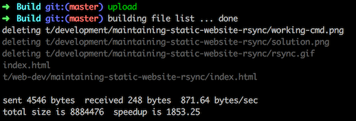
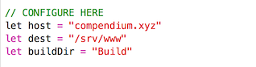

# Swift Upload

Whenever I upload a new post or update my static website I use the tried-and-tested `rsync` (I even made a post about it [here](http://bit.ly/2bToya2)). This is the `rsync` command I type every time:

```bash
rsync -avzrO --no-perms --delete . compendium.xyz:/path/to/www --exclude=".DS_Store"
```

It's a handful. Very powerful too.

While it works as intended, it's kinda laden with landmines as one mistype can have unintended consequences. I need to tread carefully all the time. One day I will might lose concentration for one second and mayhem could ensue.

### Taming the force

I'd like a command that gives me some safety, so that, for example, I won't burn myself if I momentarily lose focus  (like uploading the wrong files and deleting the ones in the server just because I'm not in the correct directory).

I'd also like a command where it allows me to continue to be in cerebral mode after finishing a post, not forcing me to switch to Linux admin mode immediately. A system where the only thing required of me is to remember&mdash;even absentmindedly&mdash;just the name of the command.

So the best compromise I came up with was to wrap my current `rsync` incantation inside a Swift script and give it a short and simple name. By doing this, I wrest some control from `rsync`'s raw power.

## Usage

Inside of my dev environment's `Build` folder I issue this command in the terminal:



`upload` basically syncs my local files with the server files behind the scenes.

But see what happens if I issue the command and I wasn't in the correct folder (`Build`):


Now on to installation.

## Configure



Inside `SwiftUpload.swift`, under the `// CONFIGURE HERE` section add your
- server host in `host` constant, 
- destination directory (path of your website's directory) in `dest` constant, and 
- the local build directory in `buildDir` constant

## Compile

Now compile the file into an executable by typing the command in the terminal:

```sh
swiftc SwiftUpload.swift -o upload
```

The `-o upload` tells the compiler that the output of this process will result in an executable named `upload`, meaning, the name of the command executable is `upload`.  One thing to note, with `swiftc` you do not need to do `chmod +x upload` anymore.

Now, if you find yourself face to face with this error, like me:

```
<unknown>:0: error: cannot load underlying module for 'CoreGraphics'
<unknown>:0: note: did you forget to set an SDK using -sdk or SDKROOT?
<unknown>:0: note: use "xcrun -sdk macosx swiftc" to select the default OS X SDK installed with Xcode
```

It means that we attempted to import some OS X lib but the compiler can't load it (in our case, the Foundation lib). It is easy to rectify though, we just use this to compile instead:

```sh
xcrun -sdk macosx swiftc SwiftUpload.swift -o upload
```

That's well and good, but rather than typing the rather long compile command just put it as an alias in `.profile` or `.zshrc` like so:

```sh
alias swiftc='xcrun -sdk macosx swiftc'
```

Then we can go back to using

```sh
swiftc SwiftUpload.swift -o upload
```

## Install

By now, an executable file named `upload` will exist in our current directory. We either move it to `/usr/local/bin` or, like me, I have a (local) `~/bin` with the PATH environment properly set, so I just move it there.